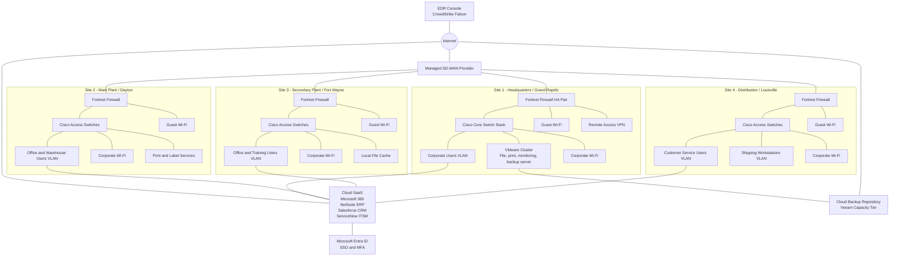

# Synthetic IT Network Diagram: Four-Site Manufacturing Business

## Provenance

- Source type: AI-generated synthetic network diagram.
- Purpose: Fake intake diagram for an IT-only NIST CSF vCISO engagement.
- Evidence status: Not evidence. Do not use for formal assessment conclusions.
- Sensitivity: INTERNAL.

## Scope Boundary

This diagram represents the corporate IT environment only. OT/ICS, PLCs, HMIs,
SCADA, CNC controllers, plant-floor controls, and machine networks are explicitly
out of scope and are not represented as assessed assets.

## Network Notes

- Each site has a Fortinet firewall and Cisco switching.
- Headquarters hosts remaining on-premises IT workloads.
- Remote access terminates at the headquarters firewall.
- Guest wireless is internet-only and logically separated from corporate IT networks.
- The managed SD-WAN connects the four corporate IT sites.
- SaaS applications are accessed over the internet and federated to Microsoft Entra ID.
- Endpoint security telemetry is managed through a cloud EDR console.

## Segments Shown

| Segment | Purpose | Sites |
| --- | --- | --- |
| Corporate users | Standard office and knowledge-worker endpoints | All sites |
| Warehouse and shipping users | IT-managed workstations for logistics workflows | Site 2, Site 4 |
| Corporate Wi-Fi | Managed wireless for company devices | All sites |
| Guest Wi-Fi | Internet-only visitor access | All sites |
| Server VLAN | On-premises IT workloads | Site 1 |
| Remote access VPN | IT-managed remote workforce access | Site 1 |

## Diagram Limitations

- This diagram is synthetic and not based on discovery evidence.
- IP addressing, firewall rules, routing details, and VLAN IDs are intentionally omitted.
- OT/ICS connectivity is not modeled and should not be inferred from this diagram.
