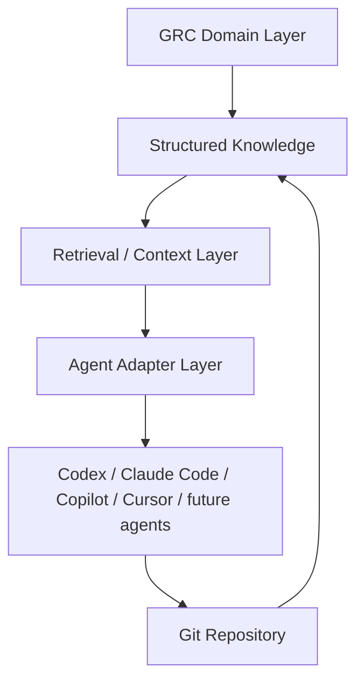
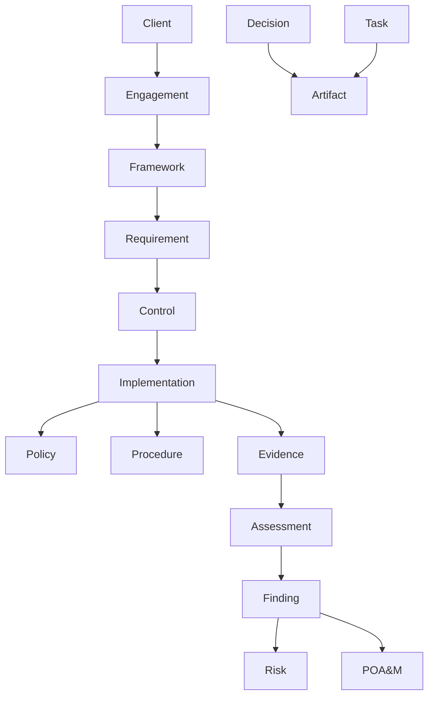

# Architecture

## Purpose

This repository is the durable memory and retrieval substrate for GRC work. It is designed so models and tools can be replaced without replacing project state.

## Layer Model



## Domain Ontology



Primary assessment chain:

```text
Framework -> Requirement -> Implementation -> Evidence -> Assessment -> Finding -> POA&M
```

Cross-framework mappings are represented as data under `knowledge/mappings/`, not hard-coded into application logic:

```text
CMMC <-> NIST SP 800-171 <-> NIST CSF <-> ISO 27001
```

CMMC is a first-class use case, but not the only use case.

## Repository State

Git stores durable state:

- client context
- decisions
- assumptions
- task backlog
- evidence metadata
- artifact manifest
- retrieval code
- validation rules

Chat history is transient and must not be treated as authoritative.

## v1 Retrieval

The first retrieval implementation uses:

- filesystem traversal
- Markdown parsing
- YAML front matter
- exact `artifact_id` lookup
- keyword search
- metadata filters
- framework/control fields

The interface supports future adapters for SQLite FTS, PostgreSQL, Qdrant, Chroma, pgvector, external enterprise search, and MCP tools.
